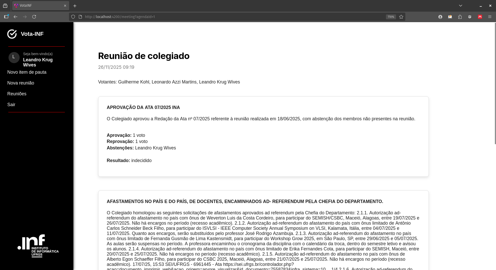
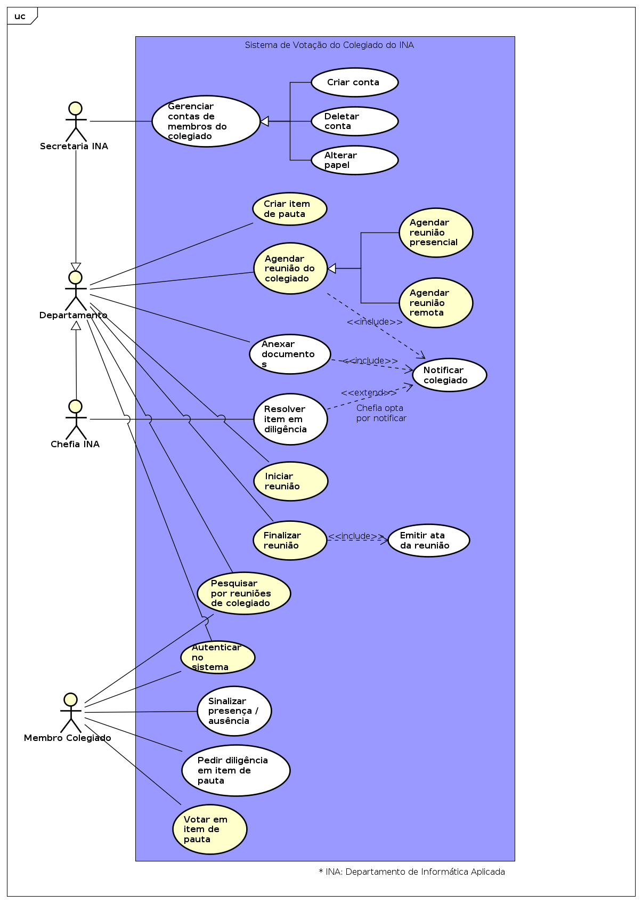
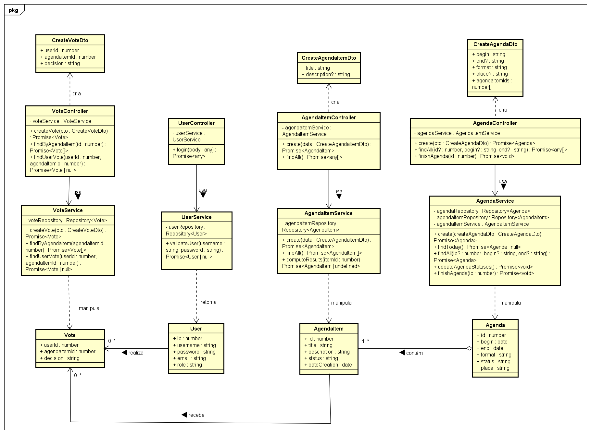
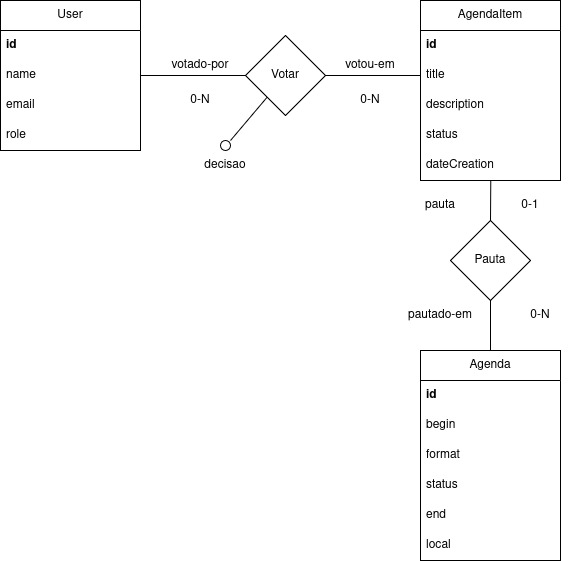
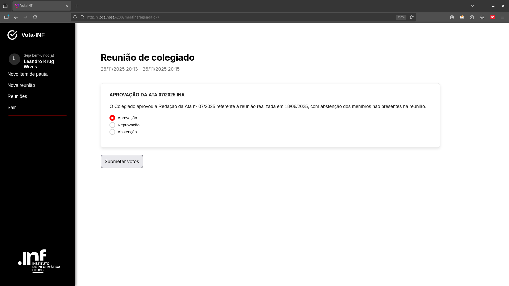
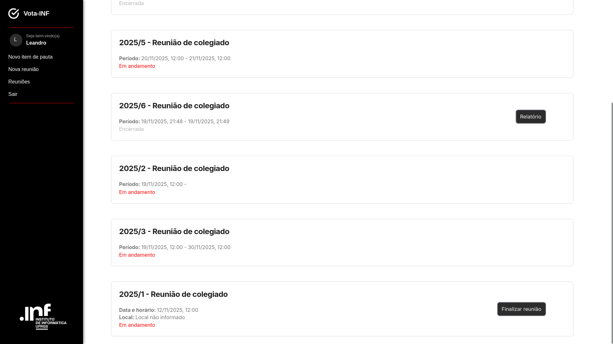

# VotaINF

Sistema de gerenciamento de votações do colegiado do Departamento de Informática Aplicada do INF-UFRGS




Stack:
- Front-end: Angular (Typescript, modo standalone)
- Back-end: NestJS
- Banco de dados: SQLite + TypeORM

# Casos de uso



# Classes



# Projeto de banco de dados (entidade-relacionamento)



# Capturas de tela






# Frameworks necessários

## Versão do Node.js

A versão do Node.js necessária para o NestJS é 20+.
Confira com:

```
node -v
```

## Angular e NestJS

Certifique-se que tenha instalado o npm antes de prosseguir.
Instale o Angular Client:

```
npm install -g @angular/cli
```

Instale o NestJS client:

```
npm install -g @nestjs/cli
```

# Rodar o projeto

## Repositório

Clone o repositório:

```
git clone https://github.com/g-kohl/VotaINF.git
cd VotaINF
```

## Dependências

Para instalar as dependências de projeto, rode:

```
npm install
```

Para instalar as dependências do back-end, rode:

```
cd backend
npm install
```

E para o front-end:

```
cd ../frontend
npm install
```

## Executar

Para rodar o front e o back-end no mesmo terminal, rode na raiz do projeto:
```
npm start
```

### Apenas back-end

Para rodar o back-end isoladamente, vá até o diretório correspondente e rode:

```
cd backend
npm run start
```

O servidor rodará em: `http://localhost:3000/`.

### Apenas front-end

Para rodar o front-end isoladamente, vá até o diretório correspondente e rode:

```
cd frontend
ng serve
```

O site rodará em: `http://localhost:4200/`.